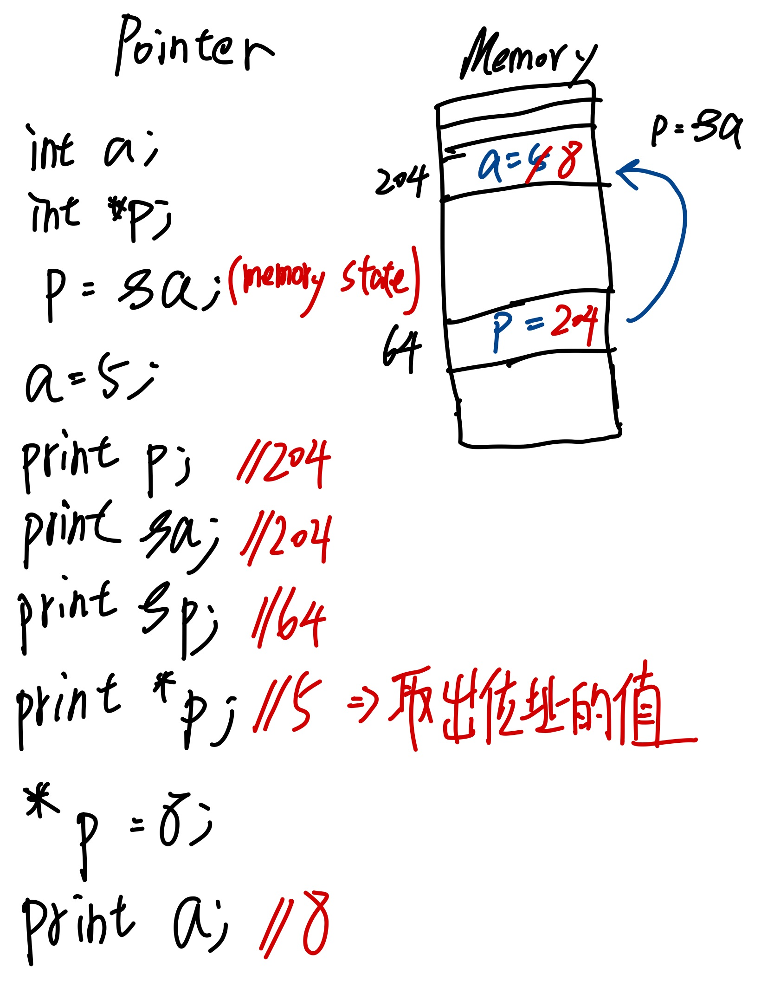

## Pointer基本知識


### Pointers
- variables that store address of other variables
```c
int a //integer
int *p // Pointer to integer
char c //character
char *po //pointer to character
p = *a;
a = 8; // (*p)->8
```
## depending
- `p` 指向了a的位址且為pointer variable，因此更動*p會更動a位止的值
```c
int main(){
    int a;
    int *p;
    a = 10;
    p = &a;
    printf("a = %d\n",a);
    *p = 12;
    printf("a = %d\n",a);
}
```

## arithmetic
- 由實驗可以知道p+1代表是將記憶體位址加上integer的size(1為integer)，因為p為一個指向a記憶體的變數
- `*(p+1)` 會出先一些垃圾值是因為p+1的記憶體位址是未被定義的，這也是C使用pointer危險的地方，因為他可以訪問未被定義的記憶體
```c
int main(){
    int a = 10;
    int *p;
    p = &a;
    printf("Address p is %d\n",p);
    printf("size of integer is %lu bytes \n",sizeof(int));
    printf("Address p+1 is %d \n",p+1);
}

---
Address p is 1795208268
value at address p is 10
size of integer is 4 bytes 
Address p+1 is 1795208272 
value at address p+1 is 1795208832 

```

## Pointer typecasting
- 重新聲明了p0以後，如果要指向p需要先將他類型轉換成 `char*`
```c
#include <stdio.h>

int main(){
    int a = 1025;
    int *p;
    p = &a;
    printf("size of integer is %lu bytes \n",sizeof(int));
    printf("Address p = %d,value = %d \n",p,*p);
    char *p0;
    p0 = (char *)p;
    printf("size of integer is %lu bytes \n",sizeof(char));
    printf("Address p = %d,value = %d \n",p0,*p0);
}

---
size of integer is 4 bytes 
Address p = 1870722124,value = 1025 
Address p = 1870722128,value = 1870722688 
size of integer is 1 bytes 
Address p = 1870722125,value = 4 
```
### 解釋為何輸出為1
```text
將1025轉為2進制
1025為int類型因此佔4byte
00000000 00000000 00000100 00000001

而我們將p0用類型轉換的方式指向p
轉換後的p0為char類型的指針佔1byte
因此只會拿到

00000001 轉為10進制 -> 1
這就說明為什麼為1

而在*(p0+1)中，會將記憶體位移1bytes
因此拿到的變為
00000100 轉為10進制 -> 4
這就說明為什麼為4
```
## Pointer to Pointer
```c
int main(){
    int x = 5;
    int *p = &x;
    *p = 6;
    int **q = &p;
    int ***r = &q;
    printf("%d\n",*p);
    printf("%d\n",*q);
    printf("%d\n",*(*q));
    printf("%d\n",*(*r));
    printf("%d\n",*(*(*r)));
    ***r= 10;
    printf("%d\n",x);
    **q = *p + 2;
    printf("%d\n",x);
}

---
6
1805530188
6
1805530188
6
10
12
```
### 解釋x的變化
```text
宣告了一個*p且指向x的記憶體位置
p -> x
宣告**q指向*p的記憶體位址
q -> p -> x
宣告***r指向**q的記憶體位址
r -> q -> p -> x
因此對r做更動
*** r = 10;
也會對x做更動，因為他們指向的都是同一個地址的值
因此對其他的指標變數的值做更動一樣會影響到x
**q = *p + 2; (此時的*p為10) p->x
相當於 x + 2 = 12;
```
## Pointers as function arguments

### Call by Value
```c
void Increment(int a){
    a = a+1;
}
int main(){
    int a;
    a = 10;
    Increment(a);
    printf("a = %d",a);
}

---
a= 10
```
#### 探討記憶體部分
1. C語言中的函數都是在stack中運行
2. main函數會在stack中名為stack frame(stack frame會儲存所有局部變數)
3. 宣告Increment函數等同於在main中的stack上再創立一個stack
4. 因此此時對Increment變數的操作都不會影響到a

### Call by reference
```c
void Increment(int *p){
    *p = (*p) + 1;
}
int main(){
    int a;
    a = 10;
    Increment(&a);
    printf("a = %d",a);
}
---
a = 11
```

#### 探討記憶體部分
```text
此時在我們的變數宣告了一個指針p
並且我們將a的位址傳給了指針p
此時等同於
int *p;
p = &a;
所以在記憶體裡面p和a有相同記憶體
p -> a
因此此時對p的值做更動就會影響到a
*p 獲得指針p的值 -> 10
(*p) + 1 -> 11
a = 11
```

## Pointers ans Arrays

### Array在記憶體的儲存方式
- `int a[5]` 相當於在記憶體中有5個連續遞增且大小為4byte的變數，總大小為 `5*4=20`
- Address `&a[i]` or `a+i`
- Value `a[i]` or `*(a+i)`
- Size `sizeof(a)/sizeof(a[0])`

### Arrays as function arguments
```c
int sumOfElements(int a[]){
    int i,sum=0;
    int size = sizeof(a) / sizeof(a[0]);
    for(i=0;i<size;i++){
        sum += a[i];
    }
    return sum;
}
int main(){
    int a[] = {1,2,3,4,5};
    int total = sumOfElements(a);
    printf("sum of a = %d",total);
}

---
sum of a = 3
```

#### 探討記憶體部分
```text
stack
----------------|
function        |
copy variable   |
----------------|
main            | stack frame
variable        |
----------------|

當我們的main將array傳入sumOfElements function中時
function的接收參數並不會拷貝整個陣列
編譯器會將int a[]轉換為int *a 來指向陣列的第一個位址
因此size會為1(4/4)而非5(20/4)
```

### 記憶體示例
- 由於我們已經知道傳入的參數會自動變成指標變數指向array
- 因此在其他functions中更動array的值也會影響到原本的array
```c
void Double(int a[],int size){
    int i;
    for(i=0;i<size;i++){
        a[i] = 2*a[i]; // a[i] is *(a+i)
    }
}
int main(){
    int a[] = {1,2,3,4,5};
    int size = sizeof(a) / sizeof(a[0]);
    Double(a,size);
    int i;
    for(i=0;i<size;i++){
        printf("%d",a[i]);
    }
}

// 246810
```

## Character arrays and pointers