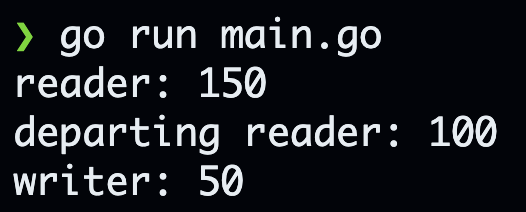

### 分析RWMutex的基本結構

```go
type RWMutex struct {
	w           Mutex        
	writerSem   uint32       // semaphore for writers to wait for completing readers
	readerSem   uint32       // semaphore for readers to wait for completing writers
	readerCount atomic.Int32 // number of pending readers
	readerWait  atomic.Int32 // number of departing readers
}

const rwmutexMaxReaders = 1 << 30

```

- pending reader/writer 等待/持有這個鎖的reader/writer
- departing reader 持有鎖但還沒釋放的reader
---
- w 當writer持有鎖的時後，會有這個互斥鎖
- writerSem 用來阻塞和喚醒writer的信號量
- readerSem 用來阻塞和喚醒reader的信號量
- readerCount 當前reader的數量，包含持有讀鎖的reader和等待的reader(因為writer有鎖的時候reader會被阻塞)
- readerWait 當前持有讀鎖的reader (上述註釋中的departing是從等待鎖的waiter出發，因為waiter希望這些鎖趕快釋放)
### 分析RLock

```go
func (rw *RWMutex) RLock() {
	if rw.readerCount.Add(1) < 0 {
		// A writer is pending, wait for it.
		runtime_SemacquireRWMutexR(&rw.readerSem, false, 0)
	}
}
```

- 因為有新的reader進來因此+1，這邊能夠理解。而為什麼為負數會在writer處說明
- `runtime_SemacquireRWMutexR(&rw.readerSem, false, 0)` 當還有reader沒釋放鎖時，writer會獲取不到鎖，而這個函數的功能可以讓下一個新的reader沒辦法獲得鎖，以避免writer一直獲取不到鎖陷入飢餓模式

### 分析RUnLock

```go
func (rw *RWMutex) RUnlock() {
	if r := rw.readerCount.Add(-1); r < 0 {
		// Outlined slow-path to allow the fast-path to be inlined
		rw.rUnlockSlow(r)
	}
}
```
- 因為有新的reader離開因此-1，這邊能夠理解。而為什麼為負數會在writer處說明

### 分析rUnlockSlow

```go
func (rw *RWMutex) rUnlockSlow(r int32) {
	// A writer is pending.
	if rw.readerWait.Add(-1) == 0 {
		// The last reader unblocks the writer.
		runtime_Semrelease(&rw.writerSem, false, 1)
	}
}
```

- `runtime_Semrelease(&rw.writerSem, false, 1)` 假設現在的reader為最後一個就會喚醒writer

## 開始分析Writer

### 分析Lock

```go
func (rw *RWMutex) Lock() {
	// First, resolve competition with other writers.
	rw.w.Lock()
	// Announce to readers there is a pending writer.
	r := rw.readerCount.Add(-rwmutexMaxReaders) + rwmutexMaxReaders
	// Wait for active readers.
	if r != 0 && rw.readerWait.Add(r) != 0 {
		runtime_SemacquireRWMutex(&rw.writerSem, false, 0)
	}
}

```
- `rw.w.Lock()` 讓多個writer請求時只會有一個獲得鎖，其他會阻塞
- `rw.readerCount.Add(-rwmutexMaxReaders) + rwmutexMaxReaders` 為第一個難點
  - `rwmutexMaxReaders 在上數宣吿為 1 << 30 =  1073741824，代表reader的數量不會超過此數 `
  - 可以利用這一串公式推得 (r為真實數量)
    - r = v + 1073741824
    - v = r - 1073741824
      - 假設真實數量的reader為24，因為有pending writer，所有readerCount變為負數(24-1073741824)=-1073741800此時來了一個新的reader=-1073741799 ，因此真實reader為-1073741799+1073741824=25
- `r != 0 && rw.readerWait.Add(r) != 0` 為第二個難點
  - 我們要將 `r != 0 && rw.readerWait.Add(r) != 0` 視為一個時間點t0
  - `rw.readerWait.Add(r) != 0` 和後面的語句是為t1
    - 如果在t0期間，departing的reader皆釋放鎖，那麼在 `rw.readerWait.Add(r)` 期間writer不會被阻塞
    - 如果在t1期間，departing的reader皆釋放鎖，那麼在 `runtime_SemacquireRWMutex(&rw.writerSem, false, 0)` 期間writer不會被阻塞
  - 這個邏輯判斷確保了writer獲取到鎖的條件
    1. 沒有departing的reader
    2. 具備departing的reader皆以釋放鎖
  
### 分析UnLock
```go
func (rw *RWMutex) Unlock() {
	r := rw.readerCount.Add(rwmutexMaxReaders) 
	for i := 0; i < int(r); i++ {
		runtime_Semrelease(&rw.readerSem, false, 0)
	}
	// Allow other writers to proceed.
	rw.w.Unlock()
}
```
- 分析RLock時有發現到他只檢查readerCount的正負，因為現在的readerCount已經為正，因此新的reader可以立即獲得鎖
- 當有新的writer時，之前的w還沒有被釋放，因此會阻塞在rw.w.Unlock()上
#### 所以當寫鎖釋放時，reader可能會優先獲得鎖，因為reader是先被喚醒的

### 分析TryLock
```go
func (rw *RWMutex) TryLock() bool {
	if !rw.w.TryLock() {
		return false
	}
	if !rw.readerCount.CompareAndSwap(0, -rwmutexMaxReaders) {
		rw.w.Unlock()
		return false
	}
	return true
}
```
- 先嘗試獲得rw.w的鎖，沒有的話就返回false反之嘗試將readerCount設為`-1<<30`
  - 成功：返回true
  - 失敗：reader獲得讀鎖，因此釋放rw.w並返回false

### 分析TryRLock

```go
func (rw *RWMutex) TryRLock() bool {
	for {
		c := rw.readerCount.Load()
		if c < 0 {
			return false
		}
		if rw.readerCount.CompareAndSwap(c, c+1) {
			return true
		}
	}
}
```
- 先去檢查reader的數量，如果`<0`代表還有活躍的writer，因此返回false
- 用原子操作的cas對readerCount嘗試+1
  - 成功：返回true
  - 失敗：
    1. 此時有writer獲取到了鎖
    2. 有新來的reader先獲得到了鎖，因此readerCount先被+1
    - 因次這邊使用for循環的原因是當產生第一個失敗狀態時會直接回到第一個的檢查狀態，但應該使用有限回圈避免死循環

### 讀寫鎖得擴展

```go
package main

import (
	"fmt"
	"sync"
	"sync/atomic"
	"time"
	"unsafe"
)

const (
	mutexLocked = 1 << iota //枷鎖標誌位
	mutexWoken //喚醒標誌
	mutexStarving // 飢餓狀態
	mutexWaiterShift = iota // waiter開始的位
)

type RWMutex struct {
	sync.RWMutex
}

type m struct {
	w           sync.Mutex
	writerSem   uint32
	readerSem   uint32
	readerCount atomic.Int32
	readerWait  atomic.Int32
}

const rwmutexMaxReaders = 1 << 30

func (rw *RWMutex) ReaderCount() int {
	v := (*m)(unsafe.Pointer(&rw.RWMutex))
	r := v.readerCount.Load()
	if r < 0 {
		r += rwmutexMaxReaders
	}
	return int(r)
}
func (rw *RWMutex) ReaderWait() int {
	v := (*m)(unsafe.Pointer(&rw.RWMutex))
	r := v.readerWait.Load()
	return int(r)
}
func (rw *RWMutex) WriterCount() int {
	v := atomic.LoadInt32((*int32)(unsafe.Pointer(&rw.RWMutex)))
	v = v >> mutexWaiterShift
	v = v + (v & mutexLocked)
	return int(v)
}
func main() {
	var mu RWMutex
	for i := 0 ; i < 100 ; i++ {
		go func ()  {
			mu.RLock()
			time.Sleep(time.Hour)
			mu.RUnlock()	
		}()
	}

	time.Sleep(time.Second)

	for i := 0; i< 50; i++ {
		go func ()  {
			mu.Lock()
			time.Sleep(time.Hour)
			mu.Unlock()	
		}()
	}
	time.Sleep(time.Second)
	
	for i := 0; i< 50; i++ {
		go func ()  {
			mu.RLock()
			time.Sleep(time.Hour)
			mu.RUnlock()	
		}()
	}

	time.Sleep(time.Second)

	fmt.Println("reader:",mu.ReaderCount())
	fmt.Println("departing reader:",mu.ReaderWait())
	fmt.Println("writer:",mu.WriterCount())
}
```

## 輸出
